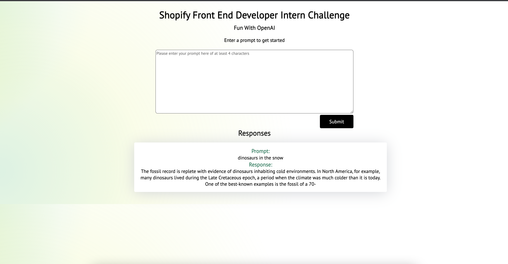

<!-- ABOUT THE PROJECT -->
## Shopify Front End Intern Challenge Fall 2022


(https://openai-fun-app.netlify.app/)

This app uses the OpenAI GPT-3 API 

<p align="right">(<a href="#top">back to top</a>)</p>


### Built With

* [React.js](https://reactjs.org/)


<p align="right">(<a href="#top">back to top</a>)</p>


### Installation

Below is an example of how you can instruct your audience on installing and setting up your app.

1. Clone the repo
   ```sh
   git clone https://github.com/your_username_/Project-Name.git
   ```
2. Install NPM packages
   ```sh
   npm install
   ```
3. Starting
   ```sh
   npm start
   ```


<p align="right">(<a href="#top">back to top</a>)</p>


